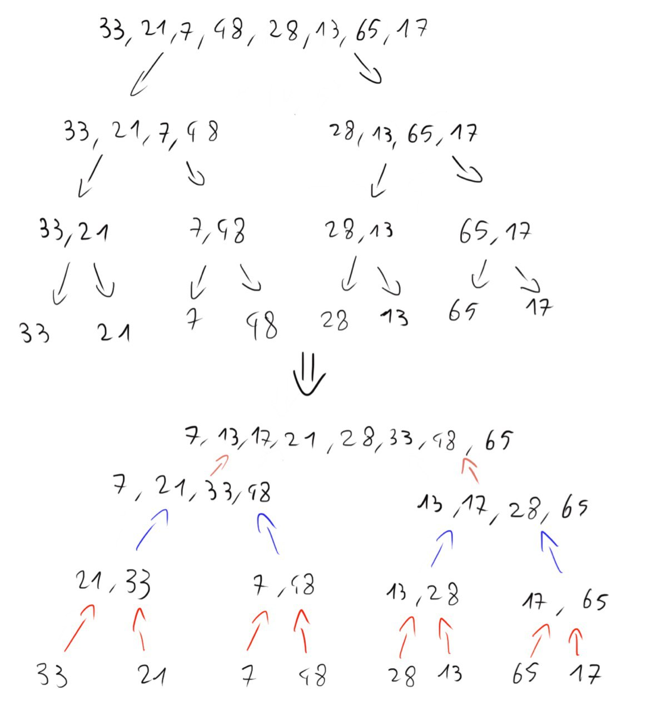

# Tutorato  24_10_2022

## Esercizi di riscaldamento

### Esercizio 0.1
Scrivere un programma che stampi un array di interi in ordine inverso a terminale attraverso una funzione ricorsiva (il programma non deve superare le 15 righe di codice)

##### Esempio
```
[3, 45, 1, 6, 4] => 4 6 1 45 3
```

### Esercizio 0.2
Scrivere un programma che ritorni gli indici di riga e colonna del massimo contenuto in una matrice di interi

##### Esempio
```
1 2 4 2
5 3 4 2   => [2, 2]
6 4 7 5
```

### Esercizio 0.3
Scrivere un programma che calcoli il prodotto tra due matrici quadrate inizializzate randomicamente con valori tra `[0, 10]` e lo stampi a video


## Esercizio 1

Scrivere un programma che permetta all'utente attraverso un piccolo menù che prende in ingresso un carattere, di eseguire tutte le operazioni necessarie per ridurre una matrice.

* La matrice è di dimensione `ROW x COL` definite come costanti all'inizio del programma
* Gli elementi della matrice saranno delle frazioni rappresentate da un array di due valori `[numeratore, denominatore]`
* Gli elementi sono inizializzati randomicamente in un range `[1, 10]` sia numeratore che denominatore
* Tutte le frazioni dovranno essere sempre ridotte ai minimi termini, con una funzione apposita
* Solo il numeratore può essere un numero negativo
-  Operazioni da implementare come funzioni da richiamare nel `main`:
   - Scambio di due righe
   - Moltiplicare una riga per un valore intero lambda
   - Poter sottrarre due righe tra di loro, salvando il risultato nella prima riga passata in input
   - Poter stampare a video la matrice

### Note
- Controllare che le righe inserite in ingresso siano valide, ovvero nell'intervallo `[0, ROW]`
- vi potrebbe tornare utile una delle implementazioni del Massimo Comun Divisore dai laboratori precedenti

## Esercizio 2
Implementare l'algoritmo di ordinamento `merge_sort`

Esempio di funzionamento


## Esercizio 3

Scrivere un programma che data una matrice, utilizzi l'algoritmo "*BubbleSort*" per ordinare im numeri all'interno di ogni riga e le righe per valore medio.
   - Generare la matrice con numeri random da 1 a 100
   - Stampare la matrice ad ogni passaggio con il valore medio alla fine di ogni riga:
      - Dopo la generazione
      - Dopo l'rdinamento dei numeri nelle righe
      - Dopo l'ordinamento delle righe per valore medio

Esempio:
```
Matrice appena generata
3       74      93      Media: 56
79      65      53      Media: 65
5       99      82      Media: 62

Bubble sort su ogni riga
3       74      93      Media: 56
53      65      79      Media: 65
5       82      99      Media: 62

Matrice ordinata
3       74      93      Media: 56
5       82      99      Media: 62
53      65      79      Media: 65
```